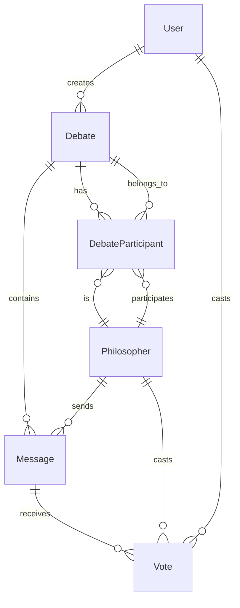

# Dialecticia - Esquema de Base de Datos 🗄️

## Visión General

Base de datos relacional optimizada para debates socráticos con filósofos virtuales, sistema de votación y persistencia de personalidades.

---

## 📊 Esquema Completo

### Core Models

```prisma
// prisma/schema.prisma

generator client {
  provider = "prisma-client-js"
}

datasource db {
  provider = "sqlite"  // "postgresql" en producción
  url      = env("DATABASE_URL")
}

model User {
  id        String   @id @default(cuid())
  email     String?  @unique
  name      String?
  createdAt DateTime @default(now())
  updatedAt DateTime @updatedAt
  
  // Relations
  debates   Debate[]
  votes     Vote[]
  
  @@map("users")
}

model Philosopher {
  id                  String   @id @default(cuid())
  name                String   @unique
  description         String
  philosophicalSchool String
  personalityTraits   Json     // PhilosopherPersonality
  coreBeliefs         String[] 
  argumentStyle       String
  questioningApproach String
  isActive            Boolean  @default(true)
  usageCount          Int      @default(0)
  createdAt           DateTime @default(now())
  updatedAt           DateTime @updatedAt
  
  // Relations
  participations DebateParticipant[]
  messages       Message[]
  votes          Vote[]
  
  @@map("philosophers")
}

model Debate {
  id          String      @id @default(cuid())
  topic       String
  description String?
  status      DebateStatus @default(TOPIC_CLARIFICATION)
  userId      String?
  isPublic    Boolean     @default(false)
  createdAt   DateTime    @default(now())
  updatedAt   DateTime    @updatedAt
  concludedAt DateTime?
  
  // Relations
  user         User?               @relation(fields: [userId], references: [id])
  messages     Message[]
  participants DebateParticipant[]
  
  @@map("debates")
}

model DebateParticipant {
  id           String @id @default(cuid())
  debateId     String
  philosopherId String
  role         ParticipantRole
  joinedAt     DateTime @default(now())
  
  // Relations
  debate       Debate      @relation(fields: [debateId], references: [id], onDelete: Cascade)
  philosopher  Philosopher @relation(fields: [philosopherId], references: [id])
  
  @@unique([debateId, philosopherId])
  @@map("debate_participants")
}

model Message {
  id            String      @id @default(cuid())
  content       String
  senderType    SenderType
  debateId      String
  philosopherId String?
  userId        String?
  turnNumber    Int
  timestamp     DateTime    @default(now())
  
  // Relations
  debate        Debate       @relation(fields: [debateId], references: [id], onDelete: Cascade)
  philosopher   Philosopher? @relation(fields: [philosopherId], references: [id])
  user          User?        @relation(fields: [userId], references: [id])
  votes         Vote[]
  
  @@map("messages")
}

model Vote {
  id            String    @id @default(cuid())
  messageId     String
  voterType     VoterType
  voterId       String    // userId o philosopherId
  value         Int       // -1, 0, 1
  createdAt     DateTime  @default(now())
  
  // Relations
  message       Message     @relation(fields: [messageId], references: [id], onDelete: Cascade)
  user          User?       @relation(fields: [voterId], references: [id])
  philosopher   Philosopher? @relation(fields: [voterId], references: [id])
  
  @@unique([messageId, voterId, voterType])
  @@map("votes")
}

// Enums
enum DebateStatus {
  TOPIC_CLARIFICATION
  ACTIVE_DEBATE
  PAUSED
  CONCLUDED
  ABANDONED
}

enum SenderType {
  USER
  PHILOSOPHER
  SYSTEM
}

enum VoterType {
  USER
  PHILOSOPHER
  EXTERNAL
}

enum ParticipantRole {
  CHALLENGER_A    // Primer filósofo desafiante
  CHALLENGER_B    // Segundo filósofo desafiante
  MODERATOR       // Futuro: filósofo moderador
}
```

---

## 🎭 Tipos TypeScript

### Personalidad de Filósofos

```typescript
interface PhilosopherPersonality {
  formality: number;      // 1-10: Formal vs Casual
  aggression: number;     // 1-10: Gentil vs Agresivo
  humor: number;          // 1-10: Serio vs Divertido
  complexity: number;     // 1-10: Simple vs Complejo
  patience: number;       // 1-10: Impaciente vs Paciente
  creativity: number;     // 1-10: Literal vs Creativo
}

interface PhilosopherStyle {
  questioningFrequency: 'low' | 'medium' | 'high';
  analogyUsage: 'rare' | 'occasional' | 'frequent';
  historicalReferences: boolean;
  useOfParadoxes: boolean;
  rhetoricalQuestions: boolean;
}

interface PhilosopherMetrics {
  debatesParticipated: number;
  messagesCount: number;
  averageVoteScore: number;
  persuasionRate: number;    // % of arguments that changed user's mind
  popularityScore: number;   // Based on user selections
}
```

### Contexto de Debate

```typescript
interface DebateContext {
  topic: string;
  currentPhase: DebateStatus;
  turnCount: number;
  participants: {
    user: boolean;
    philosophers: string[];  // IDs
  };
  keyArguments: string[];    // Argumentos principales extraídos
  contradictions: string[];  // Contradicciones detectadas
  currentFocus: string;      // Aspecto actual del debate
}
```

---

## 🔄 Relaciones y Cardinalidad



---

## 🚀 Queries Principales

### Crear Nuevo Debate

```typescript
async function createDebate(userId: string, topic: string) {
  const debate = await prisma.debate.create({
    data: {
      topic,
      userId,
      status: 'TOPIC_CLARIFICATION',
    },
  });
  
  // Generar filósofos para el debate
  const philosophers = await generatePhilosophersForTopic(topic);
  
  // Crear participantes
  await prisma.debateParticipant.createMany({
    data: philosophers.map((phil, index) => ({
      debateId: debate.id,
      philosopherId: phil.id,
      role: index === 0 ? 'CHALLENGER_A' : 'CHALLENGER_B',
    })),
  });
  
  return debate;
}
```

### Obtener Historial de Debate

```typescript
async function getDebateWithHistory(debateId: string) {
  return await prisma.debate.findUnique({
    where: { id: debateId },
    include: {
      messages: {
        include: {
          philosopher: true,
          user: true,
          votes: true,
        },
        orderBy: { timestamp: 'asc' },
      },
      participants: {
        include: {
          philosopher: true,
        },
      },
    },
  });
}
```

### Estadísticas de Filósofo

```typescript
async function getPhilosopherStats(philosopherId: string) {
  const philosopher = await prisma.philosopher.findUnique({
    where: { id: philosopherId },
    include: {
      _count: {
        select: {
          participations: true,
          messages: true,
          votes: true,
        },
      },
      messages: {
        include: {
          votes: true,
        },
      },
    },
  });
  
  // Calcular métricas
  const totalVotes = philosopher.messages.reduce(
    (sum, msg) => sum + msg.votes.length, 0
  );
  
  const positiveVotes = philosopher.messages.reduce(
    (sum, msg) => sum + msg.votes.filter(v => v.value > 0).length, 0
  );
  
  return {
    ...philosopher,
    metrics: {
      debatesParticipated: philosopher._count.participations,
      messagesCount: philosopher._count.messages,
      averageVoteScore: totalVotes > 0 ? positiveVotes / totalVotes : 0,
      usageCount: philosopher.usageCount,
    },
  };
}
```

### Top Filósofos por Popularidad

```typescript
async function getTopPhilosophers(limit: number = 10) {
  return await prisma.philosopher.findMany({
    take: limit,
    orderBy: [
      { usageCount: 'desc' },
      { createdAt: 'desc' },
    ],
    include: {
      _count: {
        select: {
          participations: true,
          messages: true,
        },
      },
    },
  });
}
```

---

## 📈 Índices y Optimización

### Índices Críticos

```sql
-- Búsqueda eficiente de debates por usuario
CREATE INDEX idx_debates_user_created ON debates(userId, createdAt DESC);

-- Mensajes ordenados por debate y tiempo
CREATE INDEX idx_messages_debate_timestamp ON messages(debateId, timestamp);

-- Filósofos por popularidad
CREATE INDEX idx_philosophers_usage ON philosophers(usageCount DESC, createdAt DESC);

-- Votos por mensaje para agregaciones rápidas
CREATE INDEX idx_votes_message_value ON votes(messageId, value);

-- Participaciones activas
CREATE INDEX idx_participants_debate_role ON debate_participants(debateId, role);
```

### Performance Considerations

1. **Paginación de mensajes**: Usar cursor-based pagination para chats largos
2. **Agregación de votos**: Cache en Redis para votaciones frecuentes
3. **Búsqueda de filósofos**: Full-text search en nombre y descripción
4. **Historial**: Lazy loading con infinite scroll

---

## 🔄 Migraciones y Seeds

### Seed Data Inicial

```typescript
// prisma/seed.ts
const seedPhilosophers = [
  {
    name: "Sócrato",
    description: "Maestro de la mayéutica digital",
    philosophicalSchool: "Filosofía Clásica",
    personalityTraits: {
      formality: 7,
      aggression: 3,
      humor: 6,
      complexity: 8,
      patience: 9,
      creativity: 7,
    },
    coreBeliefs: [
      "Solo sé que no sé nada",
      "Una vida sin examen no vale la pena ser vivida",
      "La sabiduría viene del reconocimiento de la ignorancia"
    ],
    argumentStyle: "Preguntas socráticas progresivas",
    questioningApproach: "Mayéutica: extraer conocimiento mediante preguntas",
  },
  {
    name: "Platín",
    description: "Defensor del mundo de las ideas digitales",
    philosophicalSchool: "Idealismo",
    personalityTraits: {
      formality: 9,
      aggression: 4,
      humor: 3,
      complexity: 9,
      patience: 7,
      creativity: 8,
    },
    coreBeliefs: [
      "La realidad verdadera está en el mundo de las ideas",
      "El conocimiento es reminiscencia",
      "La justicia es armonía del alma"
    ],
    argumentStyle: "Alegorías y dialectos complejos",
    questioningApproach: "División conceptual y síntesis",
  },
];

async function main() {
  for (const phil of seedPhilosophers) {
    await prisma.philosopher.upsert({
      where: { name: phil.name },
      update: {},
      create: phil,
    });
  }
}
```

---

## 🔍 Consultas Avanzadas

### Analytics de Debate

```typescript
async function getDebateAnalytics(debateId: string) {
  const messages = await prisma.message.findMany({
    where: { debateId },
    include: {
      votes: true,
      philosopher: true,
    },
  });
  
  return {
    totalMessages: messages.length,
    messagesByType: groupBy(messages, 'senderType'),
    averageVoteScore: calculateAverageVotes(messages),
    mostActivePhilosopher: findMostActive(messages),
    topRatedMessages: getTopRated(messages),
    debateProgression: analyzeProgression(messages),
  };
}
```

### Búsqueda de Debates por Tema

```typescript
async function searchDebatesByTopic(query: string, limit: number = 20) {
  return await prisma.debate.findMany({
    where: {
      OR: [
        { topic: { contains: query, mode: 'insensitive' } },
        { description: { contains: query, mode: 'insensitive' } },
      ],
      status: { not: 'ABANDONED' },
    },
    include: {
      participants: {
        include: { philosopher: true },
      },
      _count: { select: { messages: true } },
    },
    orderBy: { createdAt: 'desc' },
    take: limit,
  });
}
```

---

💡 **Principios de Diseño**: Normalización eficiente, consultas optimizadas, escalabilidad horizontal y integridad referencial. 