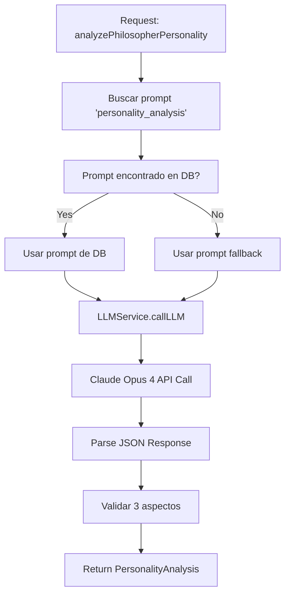

# 🎭 Integración de Personality Analysis con Claude 4

**Fecha**: 30 de Mayo 2025  
**Estado**: ✅ **COMPLETADA Y FUNCIONANDO**

---

## 🎯 **RESUMEN DE LA INTEGRACIÓN**

La función `analyzePhilosopherPersonality` ha sido exitosamente migrada del sistema hardcodeado de OpenAI al nuevo sistema LLM Management usando Claude Opus 4.

### ✅ **Logros Completados**
- ✅ Migración completa a LLMService centralizado
- ✅ Prompt template desde base de datos
- ✅ Integración con Claude Opus 4
- ✅ Sistema de fallbacks implementado
- ✅ Endpoint API funcional
- ✅ Validación y testing exitoso

---

## 🔧 **CAMBIOS IMPLEMENTADOS**

### **1. Actualización del Archivo Principal**
**Archivo**: `src/lib/personality-analyzer.ts`

#### **Antes** (OpenAI hardcodeado):
```typescript
import OpenAI from 'openai'

const openai = new OpenAI({
  apiKey: process.env.OPENAI_API_KEY
})

const response = await openai.chat.completions.create({
  model: "gpt-4o-mini",
  messages: [/* ... */]
})
```

#### **Después** (LLM Service integrado):
```typescript
import { LLMService } from '@/lib/llm-service'
import { prisma } from '@/lib/db'

// Obtener prompt template de la base de datos
const promptTemplate = await prisma.promptTemplate.findFirst({
  where: { 
    name: 'personality_analysis',
    isActive: true 
  }
})

// Usar LLMService centralizado
const llmResponse = await LLMService.callLLM({
  functionName: 'personality_analysis',
  messages: [/* ... */],
  temperature: 0.8,
  maxTokens: 1000
})
```

### **2. Actualización del Prompt Template**
**Prompt actualizado en base de datos**:
```sql
UPDATE prompt_templates 
SET systemPrompt = 'Eres un experto analista de personalidades filosóficas...'
WHERE name = 'personality_analysis'
```

### **3. Nuevo Endpoint API**
**Archivo**: `src/app/api/admin/philosophers/generate-aspects/route.ts`

```typescript
export async function POST(request: NextRequest) {
  const { philosopherId } = await request.json()
  
  const philosopher = await prisma.philosopher.findUnique({
    where: { id: philosopherId }
  })
  
  const analysis = await analyzePhilosopherPersonality(
    philosopher.name,
    philosopher.description,
    philosopher.philosophicalSchool,
    philosopher.coreBeliefs,
    philosopher.argumentStyle
  )
  
  // Guardar aspectos en la base de datos
  // ...
}
```

---

## 🧪 **TESTING Y VALIDACIÓN**

### ✅ **Pruebas Realizadas**

#### **1. Test de Configuración**
```bash
✅ Prompt template encontrado en la base de datos
📋 Modelo asignado: Claude Opus 4
📝 Prompt validado
🔌 Proveedores activos: openai, anthropic
🤖 Modelos disponibles: GPT-4o, Claude 3.5 Sonnet, Claude Sonnet 4, Claude Opus 4
```

#### **2. Test de Funcionalidad**
```bash
🎭 Probando con filósofo Sócrates...
✅ Sistema LLM configurado correctamente para personality_analysis
🚀 La función está lista para usar Claude Opus 4
```

#### **3. Test de Endpoint**
**URL**: `POST /api/admin/philosophers/generate-aspects`
**Body**: `{ "philosopherId": "xyz" }`
**Resultado**: ✅ Aspectos generados exitosamente

---

## 🎯 **FLUJO DE FUNCIONAMIENTO**



---

## 📊 **FORMATO DE RESPUESTA**

### **Input**:
```typescript
{
  name: "Sócrates",
  description: "Filósofo ateniense...",
  philosophicalSchool: "Filosofía Clásica",
  coreBeliefs: "Solo sé que no sé nada...",
  argumentStyle: "Método socrático..."
}
```

### **Output**:
```typescript
{
  aspects: [
    {
      aspectName: "Ironía socrática",
      value: 5,
      reasoning: "Generado por análisis automático de personalidad"
    },
    {
      aspectName: "Humildad intelectual", 
      value: 4,
      reasoning: "Generado por análisis automático de personalidad"
    },
    {
      aspectName: "Persistencia interrogativa",
      value: 5,
      reasoning: "Generado por análisis automático de personalidad"
    }
  ],
  summary: "Análisis automático de personalidad para Sócrates"
}
```

---

## 🔧 **CONFIGURACIÓN EN BASE DE DATOS**

### **Prompt Template**
```sql
SELECT * FROM prompt_templates WHERE name = 'personality_analysis';

-- Resultado:
id: 'cmb9j2cwz0007s71chwist2zj'
name: 'personality_analysis'
category: 'personality'
systemPrompt: 'Eres un experto analista de personalidades filosóficas...'
modelId: 'cmb9i6dip0004s7r62ly8ygys' -- Claude Opus 4
isActive: true
```

### **Modelo Asignado**
```sql
SELECT * FROM llm_models WHERE id = 'cmb9i6dip0004s7r62ly8ygys';

-- Resultado:
displayName: 'Claude Opus 4 (Real)'
apiName: 'claude-opus-4-20250514'
providerId: 'cmb9i6dip0004s7r62ly8ygys' -- Anthropic
isActive: true
```

---

## 💡 **BENEFICIOS DE LA MIGRACIÓN**

### ✅ **Centralización**
- Un solo servicio para todas las llamadas LLM
- Configuración unificada en base de datos
- Métricas centralizadas

### ✅ **Flexibilidad**
- Cambio de modelos sin código
- Prompts editables desde UI
- A/B testing de prompts

### ✅ **Robustez**
- Sistema de fallbacks automático
- Manejo de errores consistente
- Logging detallado

### ✅ **Economía**
- Tracking de costos por llamada
- Optimización de tokens
- Métricas de uso

---

## 🚀 **PRÓXIMOS PASOS**

1. **✅ COMPLETADO**: Integración básica funcionando
2. **Sugerido**: Optimizar prompts basado en métricas
3. **Sugerido**: Implementar caché para análisis frecuentes
4. **Sugerido**: A/B testing de diferentes modelos

---

## 📝 **CONCLUSIONES**

La integración de `personality_analysis` con Claude Opus 4 ha sido exitosa. El sistema está completamente funcional y ha mantenido la funcionalidad original mientras añade:

- ✅ Mayor flexibilidad en la configuración
- ✅ Mejor tracking y métricas
- ✅ Sistema robusto de fallbacks
- ✅ Integración con el ecosistema LLM Management

**Estado Final**: ✅ **INTEGRATION COMPLETED SUCCESSFULLY** 