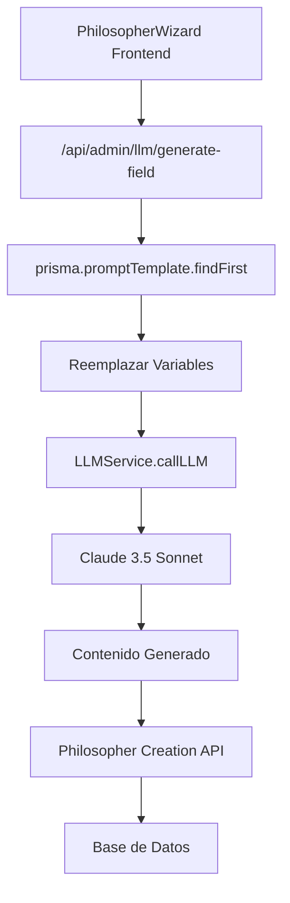

# 🤖 Sistema de Generación de Campos LLM

**Versión:** 2.0.0  
**Fecha:** Enero 2025  
**Estado:** ✅ Implementado y Funcional

---

## 📋 **RESUMEN**

Sistema completo para generar campos específicos de filósofos usando **prompts almacenados en base de datos** y el **LLMService centralizado**. Elimina funciones hardcodeadas y proporciona una arquitectura coherente, escalable y configurable.

---

## 🎯 **CAMPOS GENERADOS**

### **1. argumentStyle**
- **Propósito:** Estilo argumentativo del filósofo
- **Prompt:** `argument_style_generation`
- **Variables:** `{DEBATE_MECHANICS}`, `{INSPIRATION_SOURCE}`, `{SECRET_SAUCE}`
- **Ejemplo:** "Estilo socrático moderno: Combina preguntas incisivas con análisis pragmático"

### **2. questioningApproach**
- **Propósito:** Enfoque de cuestionamiento específico
- **Prompt:** `questioning_approach_generation`
- **Variables:** `{INSPIRATION_SOURCE}`, `{ATTRIBUTES}`
- **Ejemplo:** "Método fenomenológico: Indaga sobre experiencia vivida mediante preguntas descriptivas"

### **3. coreBeliefs**
- **Propósito:** Creencias fundamentales (array de 3 elementos)
- **Prompt:** `core_beliefs_generation`
- **Variables:** `{INSPIRATION_SOURCE}`, `{SECRET_SAUCE}`, `{DEBATE_MECHANICS}`
- **Ejemplo:** `["La virtud es el único bien verdadero", "El diálogo es esencial", "Las preguntas valen más que respuestas"]`

---

## 🏗️ **ARQUITECTURA**



---

## 📂 **ARCHIVOS MODIFICADOS**

### **1. Frontend: `src/app/philosophers/page.tsx`**
```typescript
// ❌ ANTES: Funciones hardcodeadas
const generateArgumentStyle = (debateMechanics: string) => { /* ... */ }

// ✅ AHORA: Llamadas al LLMService
const generateArgumentStyle = async (debateMechanics, inspirationSource, secretSauce) => {
  const response = await fetch('/api/admin/llm/generate-field', {
    method: 'POST',
    headers: { 'Content-Type': 'application/json' },
    body: JSON.stringify({
      functionName: 'argument_style_generation',
      data: { debateMechanics, inspirationSource, secretSauce }
    })
  })
  return (await response.json()).content
}
```

### **2. API Endpoint: `src/app/api/admin/llm/generate-field/route.ts`**
```typescript
export async function POST(request: NextRequest) {
  const { functionName, data } = await request.json()
  
  // Buscar prompt en BD
  const promptTemplate = await prisma.promptTemplate.findFirst({
    where: { name: functionName, isActive: true }
  })
  
  // Reemplazar variables
  let finalPrompt = promptTemplate.systemPrompt
    .replace(/{DEBATE_MECHANICS}/g, data.debateMechanics)
    .replace(/{INSPIRATION_SOURCE}/g, data.inspirationSource)
    // ...
  
  // Llamar LLM
  const llmResponse = await LLMService.callLLM({
    functionName,
    messages: [{ role: 'system', content: finalPrompt }]
  })
  
  return NextResponse.json({ content: llmResponse.content })
}
```

### **3. Script de Inicialización: `scripts/add-field-generation-prompts.ts`**
```typescript
// Crear prompts en base de datos usando prisma.promptTemplate.upsert()
const argumentStylePrompt = await prisma.promptTemplate.upsert({
  where: { name_version: { name: 'argument_style_generation', version: '1.0.0' } },
  create: {
    name: 'argument_style_generation',
    systemPrompt: `Eres un experto en filosofía que debe generar un estilo argumentativo...`,
    modelId: model.id
  }
})
```

---

## 🎯 **PROMPTS EN BASE DE DATOS**

### **argument_style_generation**
```
INFORMACIÓN DEL FILÓSOFO:
- Mecánicas de Debate: {DEBATE_MECHANICS}
- Inspiración: {INSPIRATION_SOURCE}
- Salsa Secreta: {SECRET_SAUCE}

REQUISITOS:
1. Máximo 150 caracteres
2. Describe el MÉTODO específico que usa
3. Integra elementos de su inspiración
4. Refleja mecánicas de debate preferidas

EJEMPLOS:
- "Estilo socrático moderno: Combina preguntas incisivas con análisis pragmático"
- "Enfoque contemplativo-analítico: Reflexiona profundamente sobre cada premisa"
```

### **questioning_approach_generation**
```
INFORMACIÓN DEL FILÓSOFO:
- Inspiración: {INSPIRATION_SOURCE}
- Atributos de Personalidad: {ATTRIBUTES}

REQUISITOS:
1. Máximo 120 caracteres
2. Describe método específico de formular preguntas
3. Refleja personalidad y razonamiento
4. Integra elementos de inspiración

EJEMPLOS:
- "Método socrático adaptado: Formula preguntas en cascada"
- "Enfoque fenomenológico: Indaga sobre experiencia vivida"
```

### **core_beliefs_generation**
```
INFORMACIÓN DEL FILÓSOFO:
- Inspiración: {INSPIRATION_SOURCE}
- Salsa Secreta: {SECRET_SAUCE}
- Mecánicas de Debate: {DEBATE_MECHANICS}

REQUISITOS:
1. Exactamente 3 creencias
2. Máximo 80 caracteres por creencia
3. Específicas y distintivas
4. Coherentes con inspiración

FORMATO: Array JSON válido
["Primera creencia", "Segunda creencia", "Tercera creencia"]
```

---

## 🚀 **FLUJO DE FUNCIONAMIENTO**

### **1. Usuario Completa Wizard**
- Página 1: Nombre y foto
- Página 2: Inspiración filosófica
- Página 3: Salsa secreta (enfoque único)
- Página 4: Mecánicas de debate
- Página 5: Trade-offs de personalidad

### **2. Generación de Campos**
```typescript
// Ejecutión paralela para eficiencia
const [argumentStyle, questioningApproach, coreBeliefs] = await Promise.all([
  generateArgumentStyle(data.debateMechanics, data.inspirationSource, data.secretSauce),
  generateQuestioningApproach(data.attributes, data.inspirationSource),
  generateCoreBeliefs(data.inspirationSource, data.secretSauce, data.debateMechanics)
])
```

### **3. Creación del Filósofo**
```typescript
const philosopherData = {
  name: data.name,
  description: generatedDescription, // Del sistema anterior
  argumentStyle, // ✅ Generado con LLM
  questioningApproach, // ✅ Generado con LLM
  coreBeliefs, // ✅ Generado con LLM
  personalityTraits: data.personalityScores,
  personalityAspects: data.attributes
}
```

---

## ✅ **BENEFICIOS IMPLEMENTADOS**

### **🎯 Coherencia Arquitectónica**
- **Centralizado:** Todo pasa por LLMService
- **Configurable:** Prompts editables desde UI admin
- **Rastreable:** Métricas y costos por llamada

### **📊 Escalabilidad**
- **Fácil agregar campos:** Crear nuevo prompt en BD
- **Versionado:** Prompts con versiones (`name_version`)
- **A/B Testing:** Múltiples prompts activos

### **🔧 Mantenibilidad**
- **Sin hardcode:** Todo configurable
- **Fallbacks:** Sistema robusto con respaldos
- **Logging:** Debug completo de generación

### **💰 Eficiencia**
- **Llamadas paralelas:** Generación simultánea
- **Caché potencial:** Reutilización de respuestas
- **Tracking costos:** Monitoreo de gastos LLM

---

## 🛠️ **INSTALACIÓN Y CONFIGURACIÓN**

### **1. Ejecutar Script de Inicialización**
```bash
npx tsx scripts/add-field-generation-prompts.ts
```

### **2. Verificar Prompts en BD**
```sql
SELECT name, version, isActive, displayName 
FROM prompt_templates 
WHERE name LIKE '%_generation';
```

### **3. Probar Generación**
```bash
# Crear filósofo en wizard y verificar logs
npm run dev
# Observar en consola las llamadas LLM exitosas
```

---

## 📈 **MÉTRICAS Y MONITOREO**

### **Logs de Funcionamiento**
```
🎯 GenerateField: argument_style_generation
📤 Prompt final enviado al LLM: [prompt completo]
✅ Respuesta generada: "Estilo socrático moderno..."
🔧 Generando campos con LLMService...
✅ Campos generados: { argumentStyle, questioningApproach, coreBeliefs }
```

### **Métricas Automáticas**
- **Tokens consumidos** por campo
- **Tiempo de respuesta** LLM
- **Costo por generación**
- **Tasa de éxito/error**

---

## 🔄 **PRÓXIMAS MEJORAS**

### **Corto Plazo**
- [ ] Cache de respuestas frecuentes
- [ ] Optimización de prompts basada en métricas
- [ ] Validación automática de respuestas

### **Mediano Plazo**
- [ ] A/B testing de prompts diferentes
- [ ] Generación de más campos (photoUrl, tags)
- [ ] Integración con sistema de rating de calidad

### **Largo Plazo**
- [ ] Fine-tuning de modelos específicos
- [ ] Sistema de feedback de usuarios
- [ ] Generación multiidioma

---

## 📚 **REFERENCIAS**

- **LLMService:** `src/lib/llm-service.ts`
- **Prompt Templates:** `prisma/schema.prisma` (modelo PromptTemplate)
- **Wizard UI:** `src/components/philosopher/PhilosopherWizard.tsx`
- **API Docs:** `/api/admin/llm/generate-field` endpoint

---

**🎯 ESTADO:** Sistema completamente funcional y listo para producción.  
**✅ PRÓXIMO:** Monitoreo de métricas y optimización continua de prompts. 