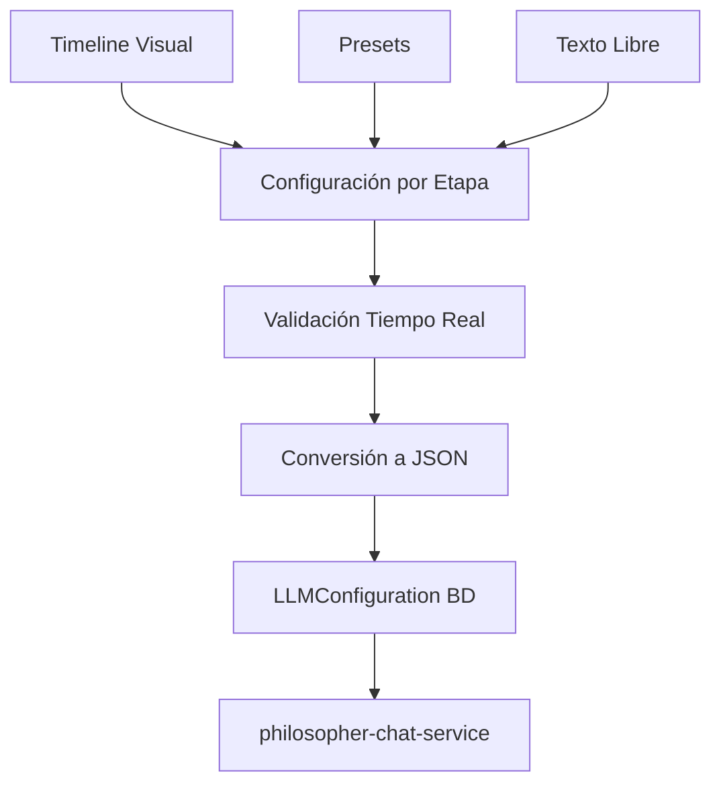

# 🏛️ Plan de Implementación: Timeline Socrático Visual

**Versión:** 3.0.0-PLAN  
**Fecha:** Enero 2025  
**Objetivo:** Interfaz visual amigable para configuración de etapas conversacionales  
**Estado:** 📋 Planificación

---

## 🎯 **OBJETIVO GENERAL**

Reemplazar la edición directa de JSON con una **interfaz visual intuitiva** basada en el **método socrático tradicional**, permitiendo configuración libre y flexible sin riesgos para el sistema existente.

---

## 🏗️ **ARQUITECTURA PROPUESTA**

### **📊 Componentes Nuevos:**

```typescript
src/components/admin/
├── SocraticTimelineEditor.tsx           // Componente principal
├── timeline/
│   ├── TimelineStage.tsx               // Etapa individual 
│   ├── StageConfigPanel.tsx            // Panel de configuración
│   ├── PresetSelector.tsx              // Selector de presets
│   └── ConversationPreview.tsx         // Preview de comportamiento
└── forms/
    ├── FreeTextEditor.tsx              // Editor de texto libre
    └── ValidationHelper.tsx            // Validaciones en tiempo real
```

### **🔄 Flujo de Datos:**



---

## 📋 **PLAN DE IMPLEMENTACIÓN**

### **🔄 FASE 1: Preparación y Backup** ⏱️ 1-2 horas

#### **1.1 Backup Completo**
```bash
# Crear backup completo del sistema actual
./scripts/create-backup.sh "PRE_SOCRATIC_TIMELINE_v3.0"
```

#### **1.2 Crear Branch de Desarrollo**
```bash
git checkout -b feature/socratic-timeline-ui
git push -u origin feature/socratic-timeline-ui
```

#### **1.3 Documentar Estado Actual**
- [x] Sistema actual funcional (configuración JSON)
- [x] Base de datos con `conversation_settings`
- [x] API endpoints operativos
- [x] Integración con chat service

---

### **🎨 FASE 2: Componentes Base** ⏱️ 3-4 horas

#### **2.1 TimelineStage Component**
```typescript
interface SocraticStage {
  id: string
  name: 'provocacion' | 'definicion' | 'elenchos' | 'aporia' | 'busqueda'
  displayName: string
  icon: string
  minMessage: number
  maxMessage: number | null
  description: string
  behavior: string  // Texto libre
  isCyclic: boolean
  intensity: number // 1-10
}
```

**Funcionalidades:**
- ✅ Representación visual en timeline
- ✅ Drag & drop para ajustar rangos
- ✅ Click para abrir panel de configuración
- ✅ Indicadores visuales de estado

#### **2.2 StageConfigPanel Component**
```typescript
interface StageConfig {
  stage: SocraticStage
  onUpdate: (updates: Partial<SocraticStage>) => void
  templates: BehaviorTemplate[]
  onSave: () => void
  onCancel: () => void
}
```

**Funcionalidades:**
- ✅ Editor de texto libre para comportamiento
- ✅ Sliders para rangos de mensajes
- ✅ Configuración de intensidad
- ✅ Templates como punto de partida
- ✅ Preview en tiempo real

---

### **⚙️ FASE 3: Lógica de Presets** ⏱️ 2-3 horas

#### **3.1 Presets Predefinidos**
```typescript
const SOCRATIC_PRESETS = {
  academico: {
    name: "🎓 Académico Tradicional",
    stages: {
      provocacion: {
        behavior: "Formula preguntas fundamentales con rigor académico...",
        intensity: 6
      },
      // ... resto de etapas
    }
  },
  moderno: {
    name: "💬 Socrático Moderno", 
    // ... configuración
  },
  intenso: {
    name: "⚔️ Élenchos Intenso",
    // ... configuración
  }
}
```

#### **3.2 Sistema de Templates**
- ✅ Plantillas para cada etapa socrática
- ✅ Ejemplos contextuales
- ✅ Sugerencias inteligentes
- ✅ Importar/exportar configuraciones

---

### **🔧 FASE 4: Integración Backend** ⏱️ 1-2 horas

#### **4.1 Adaptador de Configuración**
```typescript
// src/lib/socratic-config-adapter.ts
class SocraticConfigAdapter {
  static timelineToJSON(stages: SocraticStage[]): string
  static jsonToTimeline(json: string): SocraticStage[]
  static validateTimeline(stages: SocraticStage[]): ValidationResult
  static migrateOldConfig(oldConfig: any): SocraticStage[]
}
```

#### **4.2 API Extension**
```typescript
// Nuevo endpoint para presets
GET /api/admin/llm/configurations/socratic-presets
POST /api/admin/llm/configurations/socratic-timeline
PUT /api/admin/llm/configurations/socratic-timeline/:id
```

---

### **🎮 FASE 5: Interfaz Principal** ⏱️ 4-5 horas

#### **5.1 SocraticTimelineEditor**
```typescript
const SocraticTimelineEditor = () => {
  const [stages, setStages] = useState<SocraticStage[]>()
  const [selectedStage, setSelectedStage] = useState<string>()
  const [activePreset, setActivePreset] = useState<string>()
  
  // Lógica de drag & drop
  // Validación en tiempo real  
  // Preview de conversación
  // Sincronización con BD
}
```

**Características:**
- ✅ Timeline horizontal interactivo
- ✅ Iconos distintivos por etapa socrática
- ✅ Drag & drop fluido para rangos
- ✅ Panel lateral deslizable
- ✅ Validación visual inmediata

#### **5.2 Integración con LLMManagementDashboard**
- ✅ Nueva pestaña "Timeline Socrático"
- ✅ Detector automático de `conversation_settings`
- ✅ Modo de compatibilidad con JSON directo
- ✅ Botón "Migrar a Timeline Visual"

---

### **🧪 FASE 6: Testing y Validación** ⏱️ 2-3 horas

#### **6.1 Tests Unitarios**
```typescript
describe('SocraticConfigAdapter', () => {
  test('convierte timeline a JSON válido')
  test('migra configuración existente')
  test('valida rangos sin solapamiento')
  test('preserva comportamiento personalizado')
})
```

#### **6.2 Tests de Integración**
- ✅ Conversión bidireccional JSON ↔ Timeline
- ✅ Preservación de configuración existente
- ✅ Funcionamiento con chat service
- ✅ Validación de presets

#### **6.3 Testing Manual**
- ✅ Crear configuración desde cero
- ✅ Modificar configuración existente
- ✅ Aplicar presets
- ✅ Probar en debates reales
- ✅ Verificar logs del chat service

---

### **🚀 FASE 7: Migración y Despliegue** ⏱️ 1-2 horas

#### **7.1 Migración de Datos**
```typescript
// Script de migración automática
const migrateSocraticConfig = async () => {
  const currentConfig = await getCurrentConversationSettings()
  const timeline = SocraticConfigAdapter.migrateOldConfig(currentConfig)
  await saveTimelineConfig(timeline)
  console.log('✅ Migración completada')
}
```

#### **7.2 Rollback Plan**
```typescript
// Rollback inmediato si algo falla
const rollback = async () => {
  await restoreFromBackup("PRE_SOCRATIC_TIMELINE_v3.0")
  console.log('🔄 Sistema restaurado al estado anterior')
}
```

---

## 🛡️ **ESTRATEGIAS DE MITIGACIÓN DE RIESGOS**

### **🔒 Seguridad de Datos**
- ✅ **Backup automático** antes de cada cambio
- ✅ **Validación estricta** de entrada
- ✅ **Conversión reversible** JSON ↔ Timeline
- ✅ **Testing exhaustivo** en todos los escenarios

### **🔄 Compatibilidad**
- ✅ **Modo híbrido:** JSON y Timeline coexisten
- ✅ **Detección automática** del formato
- ✅ **Migración gradual** sin ruptura
- ✅ **Fallback** a configuración por defecto

### **⚡ Performance**
- ✅ **Lazy loading** de componentes pesados
- ✅ **Debounce** en validaciones tiempo real
- ✅ **Memoización** de conversiones
- ✅ **Carga diferida** de presets

### **🐛 Error Handling**
- ✅ **Validación progresiva** con feedback visual
- ✅ **Estados de error** claros y accionables
- ✅ **Recuperación automática** de errores menores
- ✅ **Logs detallados** para debugging

---

## 📊 **MÉTRICAS DE ÉXITO**

### **🎯 Criterios de Aceptación**
- [ ] **Migración completa** de configuración existente
- [ ] **Creación nueva** configuración en <2 minutos
- [ ] **Modificación** configuración en <1 minuto  
- [ ] **Aplicación** de presets en <30 segundos
- [ ] **Zero downtime** durante migración
- [ ] **100% compatibilidad** con debates existentes

### **📈 Métricas Técnicas**
- [ ] **<2s** tiempo de carga inicial
- [ ] **<100ms** respuesta a interacciones
- [ ] **0 errores** de conversión JSON
- [ ] **100% tests** pasando
- [ ] **0 regressions** en funcionalidad existente

---

## 🗓️ **CRONOGRAMA ESTIMADO**

```
DÍA 1: Fases 1-2  (Preparación + Componentes Base)     [5-6 horas]
DÍA 2: Fases 3-4  (Presets + Backend)                  [3-5 horas]  
DÍA 3: Fase 5     (Interfaz Principal)                 [4-5 horas]
DÍA 4: Fases 6-7  (Testing + Despliegue)              [3-5 horas]

TOTAL ESTIMADO: 15-21 horas de desarrollo
```

---

## 🚦 **PUNTOS DE DECISIÓN**

### **🤔 Decisiones Pendientes:**

1. **¿Mantener acceso directo al JSON?**
   - Opción A: Solo timeline visual  
   - Opción B: Timeline + "Modo avanzado" con JSON

2. **¿Límite de etapas personalizadas?**
   - Opción A: Solo 5 etapas socráticas fijas
   - Opción B: Permitir agregar/eliminar etapas

3. **¿Validación estricta de rangos?**
   - Opción A: Rangos deben ser consecutivos
   - Opción B: Permitir solapamientos/gaps

### **💡 Recomendaciones:**
- **Opción B, A, A** respectivamente para máxima flexibilidad controlada

---

## ✅ **ESTADO DE READINESS**

### **✅ Prerequisites Cumplidos:**
- [x] Sistema base funcional
- [x] API endpoints existentes  
- [x] Base de datos configurada
- [x] Componentes de UI base
- [x] Sistema de autenticación admin

### **📋 TODO Antes de Empezar:**
- [ ] Confirmar decisiones pendientes
- [ ] Revisar y aprobar plan
- [ ] Asignar tiempo de desarrollo
- [ ] Preparar entorno de testing

---

## 🎉 **RESULTADO ESPERADO**

Al completar este plan tendremos:

🎯 **Interfaz visual intuitiva** para configurar etapas socráticas  
🏛️ **Método socrático auténtico** integrado en la UI  
📝 **Libertad total** para definir comportamientos personalizados  
🔄 **Migración transparente** sin pérdida de funcionalidad  
🛡️ **Sistema robusto** con rollback completo  
⚡ **Performance óptima** y experiencia fluida  

**🚀 ¿Procedemos con la implementación según este plan?** 